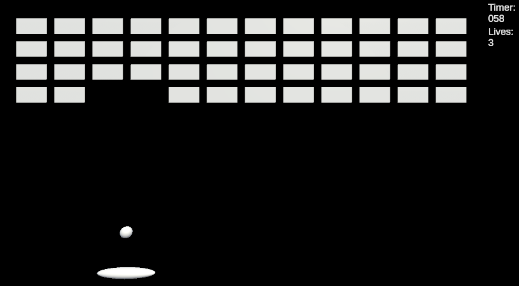

# 벽돌깨기

# GitHub

[https://github.com/mslee2129/GameDevPortfolio/tree/main/Breakout](https://github.com/mslee2129/GameDevPortfolio/tree/main/Breakout)

# 개요

- 전통 아케이드 게임 '벽돌깨기'를 유니티로 구현했습니다.
- 플레이어는 아래 바를 조종하여 좌우로 움직일 수 있으며, 튕기는 공으로 떠 있는 벽돌을 파괴해야 하는 게임입니다.
- 승패 조건: 만약 시간 제한 안에 모든 벽돌을 깨면 플레이어가 승리하며, 시간 제한 안에 벽돌을 못 깨거나 목숨 3개를 모두 잃을 경우 패배합니다. 공을 아래로 떨어트리면 목숨 하나를 잃습니다.
- 추가 기능: 5초에 한번 남아있는 벽돌 중 하나가 랜덤으로 아이템으로 변하며, 아이템 벽돌을 깰 경우 보상을 얻습니다. 아이템에는 두 종류가 있으며, 붉은 벽돌은 제한 시간에 10초를 추가하며, 초록 벽돌은 목숨을 하나 추가합니다.

# 디자인

## 게임 플로우

- 시작 화면 - 게임을 시작하기 전 간단한 안내문을 플레이어에게 보여주며, 스페이스바를 누르면 게임을 시작합니다. 공을 발사하기 앞서 플레이어는 좌우로 바를 움직이며 시작 위치를 조정할 수 있습니다.

- 게임 화면 - 게임 시작 후, 바를 좌우로 조작하여 공을 튕겨 상단의 벽돌을 맞춰야 합니다. 벽돌을 맞추면 해당 벽돌은 파괴 됩니다.

- 게임 엔딩
    - 모든 벽돌을 시간 제한 내에 파괴할 경우 게임을 승리합니다.
    
    
    
    - 만약 공을 아래로 떨어트린다면 목숨을 하나 잃습니다. 목숨을 잃을 시, 공은 플레이어 위치로 소환되며, 플레이어는 다시 공을 위로 쏠 수 있습니다.
    - 시간 제한이 지나거나, 목숨을 모두 잃을 시 게임은 종료 됩니다.
    
    
    
- 아이템 드롭 - 5초에 한번씩, 남아있는 벽돌중 하나가 랜덤으로 아이템으로 변합니다. 붉은 벽돌은 시간을 추가해주며, 초록 벽돌은 목숨을 하나 추가합니다.

## 클래스

- Player - 플레이어, 즉 아래에 움직이는 바를 구현하는 클래스입니다.
    - 플레이어는 바를 좌우로 방향키를 사용하여 움직일 수 있습니다.
- Ball - 공을 구현한 클래스입니다.
    - 게임 시작시 공의 시작 위치 설정 및 발사 전 플레이어를 따라다니는 기능.
    - 스페이스바 누를 시 발사 기능.
    - OnCollisionEnter() 를 사용해 벽돌과의 충돌을 구현. 충돌 시 벽돌 파괴.
    - OnTriggerEnter()를 사용해 아래로 떨어트릴 시 목숨 깎기 및 공 위치 재설정.
- Brick - 게임 내 벽돌 구현
    - Enum을 사용해 벽돌 종류를 나타냄 (0: 보통, 1: 목숨 추가 아이템, 2: 시간 추가 아이템
    - 랜덤으로 아이템으로 변하게 만드는 기능
- GameController - 전체적인 게임 흐름 주관
    - 게임 시작 및 종료 흐름 및 UI 발동
    - 목숨, 시간 관리
    - 벽돌이 아이템으로 변하는 시간 및 프로세스 관리
